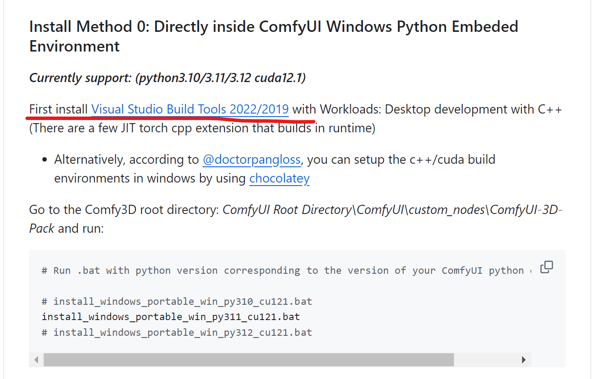
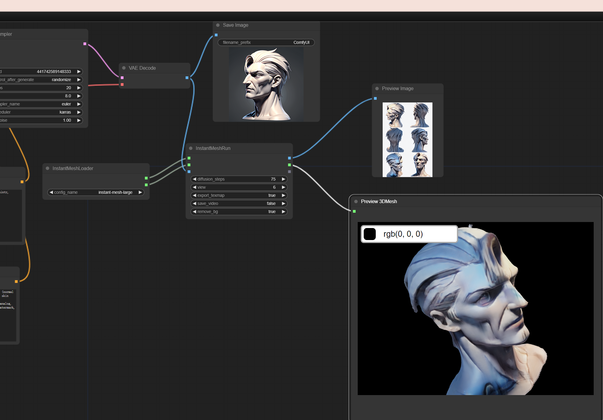

# ComfyUI InstantMesh

**ComfyUI InstantMesh** is custom nodes that running [TencentARC/InstantMesh](https://github.com/TencentARC/InstantMesh) into ComfyUI

## Installation

Make sure you also install [Visual Studio Build Tools](https://visualstudio.microsoft.com/downloads/?q=build+tools).

This extension depends on [ComfyUI-3D-Pack](https://github.com/MrForExample/ComfyUI-3D-Pack), please install it if not, and make sure it works well:
1. stop ComfyUI if it is running
2. goto `ComfyUI/custom_nodes` dir in terminal(cmd)
3. `git clone https://github.com/MrForExample/ComfyUI-3D-Pack`
4. cd `ComfyUI-3D-Pack`
5. run `install_windows_portable_win_py311_cu121.bat`

(Don't start ComfyUI at this moment)  
Then, install this extension:
1. `git clone https://github.com/jtydhr88/ComfyUI-InstantMesh`
2. cd `ComfyUI-InstantMesh`
3. run `install_windows_portable_win_py311_cu121.bat`

Start your ComfyUI.

## How to use

Currently, this extension implements two custom nodes, `InstantMeshLoader` and `InstantMeshRun`

Regarding `InstantMeshLoader`, there are four configurations for checkpoints, please refer to [TencentARC/InstantMesh](https://github.com/TencentARC/InstantMesh) for more details.

A simple workflow looks like:
 
And you can find it at [simple-workflow](instantMesh-workflow.json)  
After generated, you could find results, mesh or texture, under `ComfyUI/custom_nodes/ComfyUI-InstantMesh/output` folder.

Another workflow I provided - [example-workflow](example-workflow.json), generate 3D mesh from ComfyUI generated image, it requires:
1. main checkpoint - [ReV Animated](https://civitai.com/models/7371/rev-animated)
2. Lora - [Clay Render Style](https://civitai.com/models/108464/clay-render-style)
It will generate gypsum stype 3D model: 
 

## Credit
- [TencentARC/InstantMesh](https://github.com/TencentARC/InstantMesh) - Efficient 3D Mesh Generation from a Single Image with Sparse-view Large Reconstruction Models
- [ComfyUI](https://github.com/comfyanonymous/ComfyUI) - A powerful and modular stable diffusion GUI.
- [ComfyUI-3D-Pack](https://github.com/MrForExample/ComfyUI-3D-Pack) - An extensive node suite that enables ComfyUI to process 3D inputs (Mesh & UV Texture, etc) using cutting edge algorithms (3DGS, NeRF, etc.)

## My extensions for ComfyUI
- [ComfyUI-Workflow-Encrypt](https://github.com/jtydhr88/ComfyUI-Workflow-Encrypt) - Encrypt your comfyui workflow with key

## My extensions for stable diffusion webui
- [3D Model/pose loader](https://github.com/jtydhr88/sd-3dmodel-loader) A custom extension for AUTOMATIC1111/stable-diffusion-webui that allows you to load your local 3D model/animation inside webui, or edit pose as well, then send screenshot to txt2img or img2img as your ControlNet's reference image.
- [Canvas Editor](https://github.com/jtydhr88/sd-canvas-editor) A custom extension for AUTOMATIC1111/stable-diffusion-webui that integrated a full capability canvas editor which you can use layer, text, image, elements and so on, then send to ControlNet, basing on Polotno.
- [StableStudio Adapter](https://github.com/jtydhr88/sd-webui-StableStudio) A custom extension for AUTOMATIC1111/stable-diffusion-webui to extend rest APIs to do some local operations, using in StableStudio.
- [Txt/Img to 3D Model](https://github.com/jtydhr88/sd-webui-txt-img-to-3d-model) A custom extension for sd-webui that allow you to generate 3D model from txt or image, basing on OpenAI Shap-E.
- [3D Editor](https://github.com/jtydhr88/sd-webui-3d-editor) A custom extension for sd-webui that with 3D modeling features (add/edit basic elements, load your custom model, modify scene and so on), then send screenshot to txt2img or img2img as your ControlNet's reference image, basing on ThreeJS editor.
